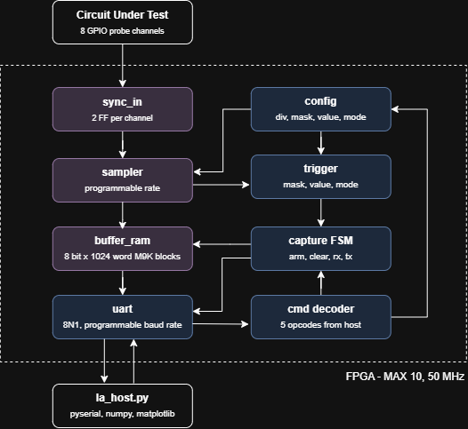
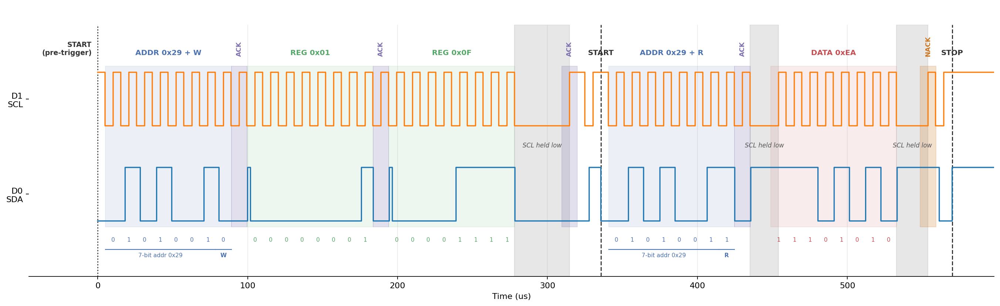

# FPGA Logic Analyzer

An 8-channel logic analyzer for the [Terasic DE10-Lite](https://www.terasic.com.tw/) (Intel MAX 10) FPGA board. The FPGA samples up to 8 digital probe lines into on-chip block RAM, waits for a configurable trigger, and streams the captured buffer back to a PC over UART. A Python host tool configures the capture, reads the data, and renders it as a step-style waveform plot.

## Features

- **8 probe channels** sampled synchronously (3.3 V logic).
- **Metastability-safe inputs** — every probe passes through a 2-stage CDC synchronizer before it is sampled.
- **Mask / value trigger** with both **level** and **edge** modes
- **Sample rates from ~3 S/s to 50 MS/s**, set by a 24-bit clock divider (`rate = 50 MHz / (div + 1)`).
- **Parameterized sample capture buffer** in on-chip M9K block RAM.
- **Parameterized UART** for configuration and readback.
- **Python host tool** for capture, PNG waveform plotting, and CSV export.

## System Architecture



**Legend** — **purple:** capture datapath · **blue:** control path · **grey:** off-chip

### Components

The design splits across the FPGA RTL (`rtl/`, `ip/`) and a PC-side host tool (`host/`):

| Component | File | Role |
|---|---|---|
| `la_top` | `rtl/la_top.v` | Top level. Holds the command decoder, config registers, and the capture/dump FSM that wires all blocks together. |
| `sync_in` | `rtl/sync_in.v` | 2-stage flip-flop synchronizer for the asynchronous GPIO probes (clock-domain crossing). |
| `sampler` | `rtl/sampler.v` | Sample-rate divider. Latches the probes once every `div + 1` clocks and emits a 1-cycle valid strobe. |
| `trigger` | `rtl/trigger.v` | Mask/value comparator. Fires when the masked channels match `value`; supports level and edge modes. |
| `buffer_ram` | `rtl/buffer_ram.v` | Capture buffer in M9K block RAM. Write side driven by the sampler, read side by the dump FSM. |
| `uart` | `ip/uart/uart.v` | Reusable UART core from a [previous project](https://github.com/emilylinchan/uart-verilog). |
| `la_host.py` | `host/la_host.py` | PC-side command-line tool: configures a capture over UART, reads the buffer back, and plots the waveform (PNG / CSV). |

## Example Application

As a real-world demonstration, an **ESP32 reads the Model ID register from a VL53L1X time-of-flight (ToF) sensor** over I2C while the logic analyzer captures the bus. The traffic-generator sketch is [test/i2c_demo/i2c_demo.ino](test/i2c_demo/i2c_demo.ino), which produces the following transaction:

```text
START | addr+W | ACK | reg | ACK | REPEATED START | addr+R | ACK | data | NACK | STOP
```

The capture is triggered on the I2C **start condition** (SDA falling while SCL is high). Wiring is **SDA → channel 0**, **SCL → channel 1**:

```bash
python la_host.py --port COM10 --rate 10000000 --channels 0,1 --mask 0x03 --value 0x02 --edge --save i2c.png --csv i2c.csv
```

- `--mask 0x03` — both channels participate in the trigger (bit0 = SDA, bit1 = SCL).
- `--value 0x02` — match SCL = 1, SDA = 0.
- `--edge` — require a prior non-matching sample, so the trigger lands on the transition *into* {SCL high, SDA low}, i.e. the start condition, rather than an already-idle bus.

Sampling at 10 MS/s heavily oversamples the 100 kHz bus (~100 samples per bit), so the captured edges line up cleanly with the decoded I2C fields below:



> 🎬 **[Watch the video demo!](https://youtu.be/mqicU0098UM?si=urb4beRlA2HFu4NL)**

## Repository Layout

```text
logic-analyzer/
├── rtl/                  # Core FPGA design
│   ├── la_top.v          #   Top level: command decode + capture/dump FSM
│   ├── sync_in.v         #   Input CDC synchronizer
│   ├── sampler.v         #   Sample-rate divider
│   ├── trigger.v         #   Mask/value trigger
│   └── buffer_ram.v      #   M9K capture buffer
├── ip/
│   └── uart/             # Reusable UART IP (see (github repo link))
├── quartus/              # Quartus project (.qpf/.qsf)
├── host/
│   ├── la_host.py        # Host-side capture + plotting tool
│   └── output/           # Saved captures (PNG / CSV)
└── test/
    └── i2c_demo/    
        └── i2c_demo.ino  # 
```

## Design Notes

- **Sample width = channel count.** Each stored sample is one byte with one bit per channel, so a byte maps cleanly to one UART transfer.
- **Buffer depth** (`8192`) is sized to the MAX 10's [M9K embedded memory blocks](https://www.airsupplylab.com/verilog-fpga/verilog_lesson-kb-03-intel-fpga-m9k-embedded-memory-blocks.html). Each sample is 8 bits wide, so the buffer uses the M9K's **1024 words × 8 bits** configuration; holding 8192 samples takes 8192 / 1024 = **8 blocks** out of the 182 available on the 10M50 device, with no wasted RAM.
- **CDC safety** — probes and the reset are both passed through 2-stage synchronizers, tagged with two Quartus synthesis attributes:
  - `SYNCHRONIZER_IDENTIFICATION` — enables MTBF calculation and tight placement of the synchronizer registers.
  - `preserve` — prevents synthesis from merging the registers or retiming the logic.
- **Capture/dump FSM** — the FSM strictly separates the write (capture) phase from the read (dump) phase. Because of that separation, a simple dual-port Block RAM (BRAM) works perfectly here: there are no runtime clock conflicts and no simultaneous read/write hazards to design around.

## Next Steps

- **FIFO for true streaming** — the current design captures a full `DEPTH`-sample buffer and only then dumps it, so sampling pauses during readback. Replacing the capture buffer with a FIFO would enable true streaming: samples could flow out over UART continuously while acquisition keeps running, decoupling the sample rate from the (slower) link and removing the fixed one-shot window.
